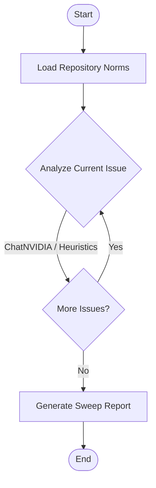

# Staleness & Backlog Agent

This directory contains the implementation of the **Staleness / Backlog Agent**, built using **LangChain** and **LangGraph** to automate issue sweeps, evaluate staleness thresholds, check blocking conditions, and draft appropriate action comments.

## Architecture & Workflow

The agent uses a LangGraph state machine (`StateGraph`) to analyze issues:



1. **Load Repository Norms**: Reads project guidelines (e.g. median response times, Contributing Rules, auto-close thresholds).
2. **Analyze Current Issue**: Loops through each issue. If `NVIDIA_API_KEY` is provided, it prompts ChatNVIDIA using `nvidia/nemotron-3-nano-30b-a3b` to categorize blockages and draft responses. If the API key is not configured, it runs on a robust heuristic engine.
3. **Generate Sweep Report**: Compiles results into a comprehensive markdown report listing recommended actions (Nudge, Auto-Close, Escalate, Keep Open) with reasoning.

## Setup Instructions

1. Navigate to the agent's folder:
   ```bash
   cd Agents/backlog_agent
   ```

2. Create and activate a Python virtual environment:
   ```bash
   python -m venv .venv
   # On Windows:
   .venv\Scripts\activate
   # On Unix/macOS:
   source .venv/bin/activate
   ```

3. Install the dependencies:
   ```bash
   pip install -r requirements.txt
   ```

4. Configure your `.env` file (if you have an NVIDIA API Key):
   Open `.env` and fill in:
   ```env
   NVIDIA_API_KEY=your_nvidia_api_key_here
   NVIDIA_MODEL=nvidia/nemotron-3-nano-30b-a3b
   ```

## Running the Sweep Simulation

To run the agent on simulated mock issues (including Issue #390 reporter-blocked scenario):
```bash
python main.py
```

This will run the backlog sweep and generate a `sweep_report.md` output file.
