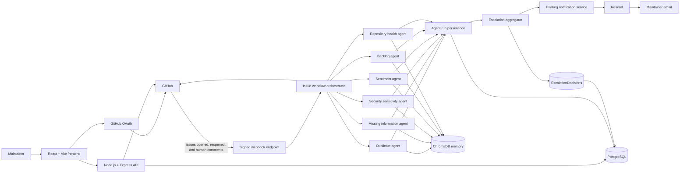
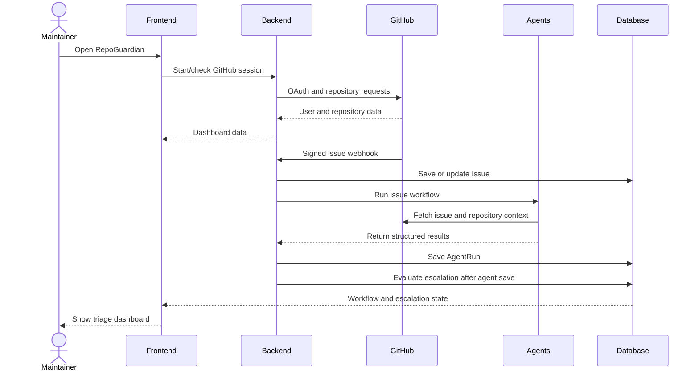

# RepoGuardian

RepoGuardian is a GitHub repository intelligence and issue-triage platform. It connects to GitHub, presents repository activity in a React dashboard, and runs automated analysis when issues are opened or updated.

The system is designed to help maintainers answer three practical questions quickly:

- What is happening in this repository?
- Which issues need more information or a maintainer decision?
- Is there a security or workflow problem that should be escalated?

## What It Does

After a user signs in with GitHub, RepoGuardian can:

- List the user's repositories.
- Show repository overview information, stars, forks, watchers, language, license, and activity.
- Browse issues, pull requests, commits, contributors, and code changes.
- Expand commits to inspect changed files and patches.
- Analyze issues with six specialized agents.
- Show live workflow progress in a centralized triage dashboard.
- Detect security-sensitive issues and calculate a danger score.
- Store issues, agent runs, workflow state, feedback, timelines, and escalation decisions in PostgreSQL.
- Keep semantic repository memory in ChromaDB when it is available.
- Escalate qualifying issues through an aggregation step and attempt maintainer email notification through Resend.

## Architecture



## Repository Layout

```text
.
├── backend/
│   ├── server.js                 Express application entrypoint
│   ├── routes/                   OAuth, repository API, agents, webhooks, escalation
│   ├── services/                 Workflow persistence, RAG, notifications
│   ├── models/                   Sequelize models
│   ├── migrations/               PostgreSQL schema migrations
│   └── Agents/
│       ├── Duplicate_agent/
│       ├── missing_iinfo_agent/
│       ├── sensitivity_agent/
│       ├── sentiment_analysis/
│       ├── backlog_agent/
│       ├── Health_agent/
│       ├── escalation_aggregator/
│       └── common/
├── frontend/
│   ├── src/App.jsx               React screens and dashboard components
│   ├── src/App.css               Theme and responsive dashboard styles
│   └── src/index.css             Global styles
└── render.yaml                   Render backend deployment configuration
```

## Main User Flow



## The Six Issue Agents

The workflow currently runs six existing analysis agents. Their results are saved in `AgentRuns` and displayed in the centralized issue analysis view.

### Duplicate Check

Compares the incoming issue with existing issue history. It looks at symptoms, error messages, stack traces, operating systems, versions, comments, and closure context. It returns likely matches, classifications, confidence, evidence, and a suggested action.

Implementation: `backend/Agents/Duplicate_agent/duplicate_agent.py`

### Missing Information

Checks whether an issue contains enough information to investigate. It looks for details such as environment, version, reproduction steps, expected behavior, actual behavior, logs, and error messages. It can draft a request for the reporter without posting directly from the Python agent.

Implementation: `backend/Agents/missing_iinfo_agent/missing_info_agent.py`

### Security Sensitivity

Looks for credentials, API keys, private keys, database connection strings, vulnerabilities, exploits, injection attacks, authentication bypasses, CVEs, and GitHub Security Advisory references. It returns a danger score from `0` to `100`, security status, priority, evidence, and private-disclosure guidance.

Implementation: `backend/Agents/sensitivity_agent/sensitivity_agent.py`

### Sentiment

Analyzes discussion tone, contention, disagreement, and communication patterns. It can use repository memory to compare similar historical discussions.

Implementation: `backend/Agents/sentiment_analysis/`

### Backlog Context

Reviews issue age, activity, repository norms, response patterns, and blocking context. It recommends actions such as nudge, keep open, auto-close, or escalate.

Implementation: `backend/Agents/backlog_agent/`

### Repository Health

Analyzes repository-level time series such as response time, backlog size, incoming issue volume, closed issues, duplicate rate, and contributor activity. It is primarily a scheduled or repository-level trend agent rather than a single-issue classifier.

Implementation: `backend/Agents/Health_agent/health_agent.py`

## Escalation Aggregator

The seventh component is the escalation aggregator. It runs after agent results are persisted and waits until all six required categories are present for an issue.

Implementation:

```text
backend/Agents/escalation_aggregator/aggregator.js
backend/Agents/escalation_aggregator/scoringRules.js
```

The aggregator does not modify the existing `workflowStatus` field. It stores its result in the separate `EscalationDecisions` table.

A decision contains:

```json
{
  "needsAttention": true,
  "triggeringCategories": ["security"],
  "aggregateConfidence": 0.82,
  "perCategoryBreakdown": {},
  "notificationSent": true
}
```

### Escalation Rules

- Security confidence above `0.5` always escalates.
- A direct duplicate escalates only when confidence is at least `0.75`.
- Missing information never escalates by itself.
- Sentiment does not escalate by itself; its multiplier can strengthen another signal.
- Backlog escalates only when its verdict is exactly `escalate`.
- Repository health escalates only for an inflection-point signal, not a routine metric.
- The combined non-security score must reach the configured threshold.

The aggregator is idempotent for an issue, so repeated agent-save events do not send the same escalation email repeatedly.

## Notifications

When the aggregator decides that an issue needs attention, it calls the existing notification service:

```text
backend/services/notificationService.js
```

The notification service:

1. Checks whether the category is allowed to notify.
2. Finds maintainers with instant email preferences.
3. Sends through Resend.
4. Records whether at least one email send succeeded in `EscalationDecisions.notificationSent`.

Required configuration includes:

```env
RESEND_API_KEY=your_resend_key
NOTIFICATION_FROM_EMAIL=verified-sender@example.com
DASHBOARD_URL=https://your-frontend.example.com
```

The notification service expects a `notification_preferences` table with enabled recipients. That table is not currently included in the repository migrations, so email delivery requires that table to exist in the deployed database.

## API Surface

### Authentication

```text
GET  /auth/github
GET  /auth/github/callback
GET  /auth/github/install
GET  /auth/me
GET  /auth/logout
```

### Repository API

```text
GET /api/repos
GET /api/repos/:owner/:repo/details
GET /api/repos/:owner/:repo/commits/:sha
GET /api/repos/:owner/:repo/tree
POST /api/repos/:owner/:repo/chat
```

### Manual Agent Runs

```text
POST /api/agents/backlog-sweep
POST /api/agents/duplicate-check
POST /api/agents/health-report
POST /api/agents/missing-info
POST /api/agents/sensitivity-check
POST /api/agents/sentiment-analysis
```

### Webhooks and Workflow State

```text
POST /api/webhooks/github
POST /api/webhooks
GET  /api/webhooks/status
GET  /api/webhooks/analysis/:owner/:repo
GET  /api/webhooks/analysis/:owner/:repo/:number
```

The webhook validates the GitHub `x-hub-signature-256` header. It accepts issue events and human issue-comment events, then starts or resumes workflow processing.

### Escalation State

```text
GET /api/issues/:issueId/escalation
GET /api/issues/:owner/:repo/escalations
```

The repository escalation endpoint returns only persisted decisions where `needsAttention` is `true`. Pending or auto-handled issues remain in the regular issue list.

## Frontend

The frontend is a React 19 application built with Vite. The main UI is in `frontend/src/App.jsx` and styled in `frontend/src/App.css`.

The dashboard includes:

- GitHub OAuth entry screen.
- Repository search and repository cards.
- Repository overview dashboard.
- Issues, pull requests, commits, contributors, and code changes views.
- Expandable commit diff inspection.
- Repository chat backed by repository context and RAG search.
- Centralized issue triage dashboard.
- Six-agent activity sidebar.
- Security risk card.
- Escalation status card.
- Escalations queue with High Priority issues sorted by aggregate confidence.
- Light and dark themes with localStorage persistence.
- Responsive desktop, tablet, and mobile layouts.

## Technology Stack

### Frontend

- React 19
- Vite
- JavaScript and JSX
- CSS variables and responsive CSS
- ESLint

### Backend

- Node.js
- Express 5
- Express sessions
- Sequelize
- PostgreSQL and `pg`
- `connect-pg-simple` for persistent sessions
- GitHub REST API and webhooks
- Resend for email delivery

### Agent Runtime

- Python
- LangChain
- LangGraph
- NVIDIA AI Endpoints when configured
- Requests
- Pydantic
- ChromaDB
- `pg8000` for optional Python-side PostgreSQL history

### Deployment

Render is configured through `render.yaml`. The backend deployment:

1. Installs Node dependencies.
2. Runs Sequelize migrations.
3. Creates a Python virtual environment.
4. Installs Python agent dependencies.
5. Starts the Express server.

The Render configuration also provisions a persistent disk for ChromaDB memory at:

```text
/var/data/repoguardian-memory
```

## Local Setup

### Prerequisites

- Node.js
- npm
- Python 3
- PostgreSQL database
- GitHub OAuth application
- GitHub webhook access
- Optional NVIDIA API key
- Optional Resend account and verified sender domain

### Backend

```powershell
cd backend
npm install
python -m venv .venv
.venv\Scripts\Activate.ps1
pip install -r requirements.txt
npx sequelize-cli db:migrate
npm start
```

The backend listens on the port configured by `PORT`, or port `3000` by default.

### Frontend

```powershell
cd frontend
npm install
npm run dev
```

The frontend uses `VITE_API_BASE_URL` when provided. Otherwise it uses the configured deployed backend URL in `frontend/src/App.jsx`.

## Environment Variables

A typical backend environment contains:

```env
PORT=3000
SESSION_SECRET=replace-me
FRONTEND_URL=http://localhost:5173
DATABASE_URL=postgresql://...

GITHUB_CLIENT_ID=...
GITHUB_CLIENT_SECRET=...
GITHUB_TOKEN=...
GITHUB_WEBHOOK_SECRET=...
GITHUB_OWNER=...
GITHUB_REPO=...

NVIDIA_API_KEY=...
NVIDIA_LLM_MODEL=...
NVIDIA_EMBED_MODEL=...

RESEND_API_KEY=...
NOTIFICATION_FROM_EMAIL=...
DASHBOARD_URL=http://localhost:5173

MEMORY_STORE_DIR=.memory_store
```

Never commit `.env` files or expose API keys in logs, screenshots, issues, or documentation.

## Testing and Validation

Frontend checks:

```powershell
cd frontend
npm run lint
npm run build
```

Backend syntax checks:

```powershell
cd backend
node --check server.js
node --check routes/webhooks.js
node --check routes/escalation.js
node --check Agents/escalation_aggregator/aggregator.js
```

Escalation scoring tests:

```powershell
cd backend
node Agents\escalation_aggregator\scoringRules.test.js
```

Migration status:

```powershell
cd backend
npx sequelize-cli db:migrate:status
```

Database connection check:

```powershell
cd backend
node -e "require('dotenv').config(); const { sequelize } = require('./models'); sequelize.authenticate().then(() => console.log('PostgreSQL connected')).finally(() => sequelize.close())"
```

## Current Limitations

- The notification-preferences table is referenced by the existing email service but is not currently defined in this repository's migrations.
- Email delivery requires valid Resend credentials, a permitted sender, enabled recipient preferences, and a working GitHub webhook workflow.
- The frontend displays escalation decisions persisted in PostgreSQL; decisions are not fabricated for issues with incomplete agent runs.
- ChromaDB memory is optional. Agents fall back to live data and deterministic local embeddings when it is unavailable.
- Some workflows stop early when duplicate evidence or missing information requires a reporter response. Those issues do not receive a completed six-agent escalation decision until the workflow resumes.
- The backend has no general automated test suite yet; focused scoring tests and build/lint checks are available.

## License

No license file is currently included in the repository. Add a license before distributing RepoGuardian publicly.
