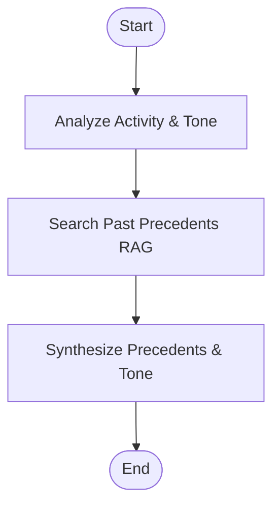

# Contention & Sentiment Analysis Agent

This directory contains the implementation of the **Contention / Sentiment Agent**, built using **LangChain** and **LangGraph** to scan PRs/Issues for disputes, analyze interaction patterns, compare against historical precedent (RAG), and flag items needing human review.

## Architecture & Workflow

The agent uses a LangGraph state machine (`StateGraph`) to analyze discussion sentiment:



1. **Analyze Activity & Tone**: Measures comment counts relative to repo baselines and queries the LLM (ChatNVIDIA) to assess conflict level, clipped language, and determine the core disagreement point.
2. **Search Past Precedents (RAG)**: Queries a historical database of past disputes to search for similar technical arguments (such as JSON vs YAML configuration disagreements) and how they were resolved.
3. **Synthesize Findings**: Integrates the current discussion analysis with RAG precedents, determining if human maintainer judgment is required, and recommends a specific resolution compromise.

## Setup Instructions

1. Navigate to the agent's folder:
   ```bash
   cd backend/Agents/sentiment_analysis
   ```

2. Create and activate a Python virtual environment:
   ```bash
   python -m venv .venv
   # On Windows:
   .venv\Scripts\activate
   # On Unix/macOS:
   source .venv/bin/activate
   ```

3. Install the dependencies:
   ```bash
   pip install -r requirements.txt
   ```

4. Configure your `.env` file (copied automatically during setup):
   ```env
   NVIDIA_API_KEY=your_nvidia_api_key_here
   NVIDIA_MODEL=nvidia/nemotron-3-nano-30b-a3b
   ```

## Running the Contention Sweep Simulation

To run the agent on the simulated contentious PR #515 (JSON vs YAML config refactoring):
```bash
python main.py
```

This will run the sweep and save a `contention_report.md` output file.
